# **OfficeAI.Chat.Word (原WordGPT)产品说明**

## 1 软件简介

OfficeAI.Chat 是一款一站式 AI 智能内容创作与文稿处理插件，深度适配办公全场景需求。

1. **多元内容智能生成** ：支持接入自定义私有知识库或联网检索权威素材，一键快速产出论文、简历、博文、新闻稿件、产品文案、短篇故事、商务邮件、影视剧本、诗词、工作总结等各类文稿；同步自动生成思维导图、配图、数据图表，依托文稿内容一键生成配套 PPT。
2. **全维度文本精加工** ：搭载专业文本处理引擎，提供全文校对、语句润色、内容提炼摘要、篇幅扩写、精简缩写能力，智能筛查原文语病、逻辑漏洞与用词问题，针对性输出修改方案与优化改写版本。
3. **多语种即时翻译** ：覆盖全球多语种互译，满足外文写作、文档翻译、跨境办公沟通等翻译需求。
4. **智能排版自动化** ：文稿定稿后可一键自动规整全文版式、统一格式样式，省去手动排版耗时，大幅提升办公效率。

   （适配系统：Windows 适配软件：Office、WPS）

## 2 软件安装

### 2.1软件下载

[下载地址1](https://www.123pan.com/s/Czz1Td-glxxA.html)  [下载地址2](https://pan.baidu.com/s/1iNtgi479sWEk0ZmUoibqTQ?pwd=NewB)  

适用于Windows系统，推荐使用Win10以上系统及Office2012以上版本，WPS最新版本

### 2.2软件安装

安装前的准备工作：

* 关闭Office、WPS相关软件；
* 部分无管理员权限的电脑建议先关闭电脑杀毒软件，安装完成后再开启。
* 下载解压安装包

 **1、** **安装插件**

双击或右键->已管理员身份运行setup.exe文件安装插件

安装过程依次点击【下一步】按钮即可

进入Office(Word\Excel\PowerPoint)后点击确认安装

### 2.3软件升级

点击【升级软件】按钮即可自动检查并更新到最新版本。

如果有新版本，等待下载完成按向导步骤执行更新安装，安装完成后重新打开Word或WPS即可。

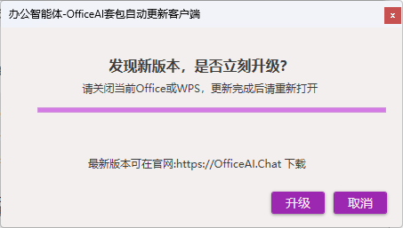

### 2.4 登录或自定义模型API使用

**2.4.1用户登录(目前免费)**

* 勾选“登录-使用软件默认模型”，输入用户名、密码点击【确定】按钮登录
* 新用户点击【免费注册】按钮注册账号后登录使用
* 忘记登录密码可点击【忘记密码】按钮通过手机号重置密码

  **2.4.2设置自定义模型API使用（永久免费）**
* 勾选“免登录-使用自定义模型”
  
* 设置模型ID，目前推荐深度求索deepseek-v4-flash、智普glm5.1、阿里Qwen3.7-Max、OpenAI的GPT-5.5（境外用户）
* 设置API Key(进入大模型管理后台复制API Key粘贴进API Key文本框)
* 设置API Url地址(进入大模型管理后复制APIUrl地址粘贴进APIUrl地址文本框)
  软件已默认帮配置主流deepseek、智普、阿里百炼等标准地址，选择后自动填入，也可以从其他模型平台复制粘贴Url地址，注意末尾需要带类似/v1的版本号
  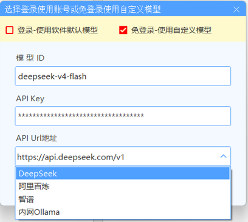
  内网使用Ollama可完全离线内网使用
  内网Ollama模型地址参考以下格式配置（注意：以**/v1**结尾）
  http://[Ollama服务器IP地址]:11434/v1

## 3功能说明

### 3.1OfficeAI智能体

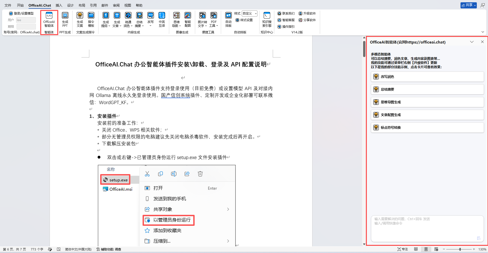

OfficeAI 智能体是具备自主任务拆解与执行能力的办公智能助手，依托自然语言指令即可全自动代办各类文档工作。无需手动分步操作，仅需下达目标需求，智能体自动规划流程、落地执行。

支持多类核心办公能力：文稿创作、多语种翻译、配图生成、数据分析制图；同时具备文档批量文字替换、内容样式编辑、一键自动化排版能力，可覆盖绝大多数 Office、WPS 常规编辑操作，全流程代劳办公琐事，详细功能分类如下：

* 📝文档编辑与处理

| 功能         | 说明                                   |
| ------------ | -------------------------------------- |
| ✍️润色改写 | 优化文字表达，让语句更流畅、专业、地道 |
| 📖扩写丰富   | 在原文基础上扩展内容，增加细节描述     |
| 📋总结摘要   | 提炼长文本的核心观点，快速获取关键信息 |
| 🌐翻译       | 中英文互译，自动识别源语言             |
| 🔄查找替换   | 批量替换文档中的指定文字               |
| 🔣标点转换   | 中文/英文标点符号批量互转              |
| 🧹清除空字符 | 删除文档中的多余空格和空白字符         |

* 🎨排版与美化

| 功能             | 说明                                     |
| ---------------- | ---------------------------------------- |
| ⚡一键排版       | 按公文、论文或自定义样式自动排版         |
| 🎯设置文字格式   | 修改字体、字号、颜色、加粗、斜体、对齐等 |
| 🖼️批量调整图片 | 统一设置文档中所有图片的尺寸             |
| 🎨背景颜色       | 设置文档页面背景色                       |
| 📏删除页眉横线   | 一键去除页眉底的边框线                   |
| 🔍语法检查       | 开启/关闭拼写和语法检查                  |

* 📊智能生成

| 功能           | 说明                               |
| -------------- | ---------------------------------- |
| 🧠思维导图     | 根据主题生成脑图，梳理知识框架     |
| 📊知识图谱     | 展示概念之间的关系图谱             |
| 📈数据分析图表 | 对数据进行分析并生成可视化图表     |
| 🖼️AI绘图     | 根据文字描述生成图片               |
| 🗺️地图标记   | 标注地址位置，可视化展示           |
| 📑创建表格     | 生成对比表、数据统计表等结构化表格 |

### **3.2 生成提纲**

对选中的关键词(可多个)或短语进行提纲生成。

(1)选中关键词或关键语句

(2)点击【生成提纲】功能按钮，可根据需求选择精确、平衡、创新方案

### **3.3生成文章**

对选中的提纲或短语进行文案生成。

(1)选中需要生成文案的提纲，点击【生成文章】按钮

(2)可根据需求选择精确、平衡、创新方案

## **3.4 疏通润色**

选择需要疏通润色的段落，点击【疏通润色】按钮，疏通润色后语句的结果以批注的方式呈现，方便和已有文案形成对比。如果对疏通润色的结果满意，可直接复制替换回当前文档。

### **3.5总结摘要**

对选中的段落进行总结生成摘要。

点击【总结摘要】按钮，结果以批注的方式呈现，方便和已有文案形成对比。如果对总结的结果满意，可直接复制替换到当前文档。

### **3.6改写**

对选中文本进行扩写或缩写。

（1）扩写

选需要扩写的短语点击【扩写】按钮可将选中文本进行扩写，重复执行此步骤可以不断扩写文章。

（2）缩写

选中需要缩写的段落点击【缩写】按钮按钮可在不改变原意的情况下将段落进行缩写。

### **3.7中英互译**

### **3.8快****捷指****令**

点击【快捷指令】，进入快捷提示语界面，按①~⑥步骤可灵活配置生成文案的参数。选择角色，风格，类型，语言，及简明扼要概括描述对生成内容的要求。定义完成后，点击生成按钮。

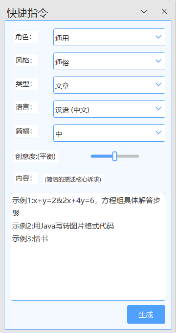

(1)角色、风格、类型、语言，如果下拉选项没有选择项，可以直接进行输入，如语言想要西班牙语，可输入西班牙语；类型想要数据报表，则可输入数据报表；

(2)生成篇幅有短、中、长三个选项，篇幅长短根据大语言模型的实际输出为准。由于中文与其他语言之间转换，及大语言模型生成的能力，实际生成篇幅可能会有偏差。

### **3.9指令模板**

WordGPT内置了大量的提示语模板，可以直接调用。选择提示语后，可根据需求修改替换【】标签内的文本，点击生成；

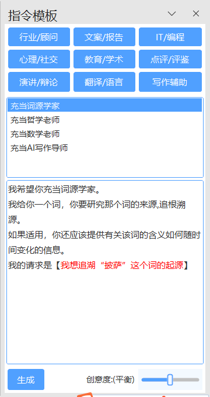

### **3.10思维导图(仅可在Word中使用，Wps中暂不支持)**

可以按文章段落生成总结型的思维导图（选用精确方案、平衡方案最佳）与头脑风暴预测型思维导图（选用创新方案最佳）

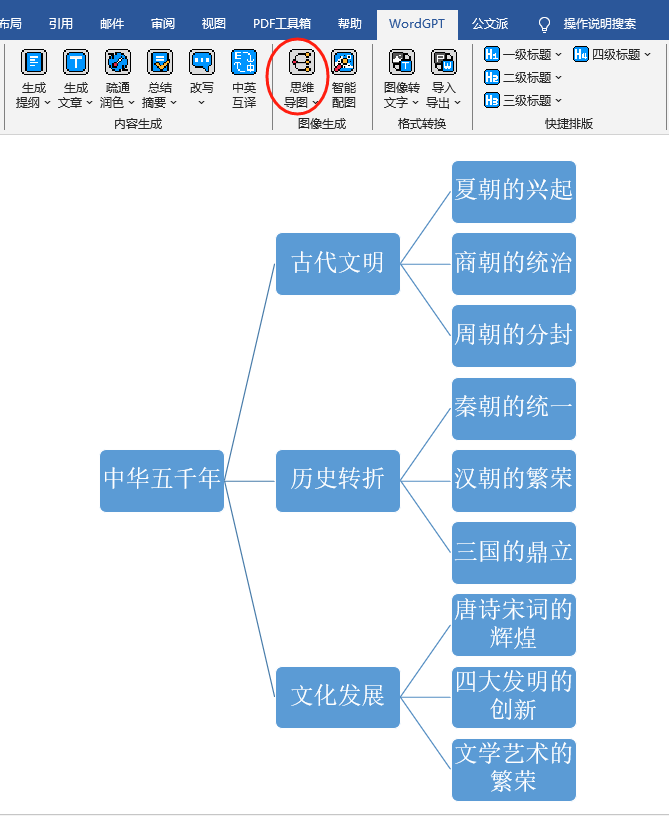

**（1）总结型思维导图：**

选中文章段落，点击【思维导图】-【平衡方案】，自动生成文章段落结构图

**（2）预测型思维导图：**

选中关键词，点击【思维导图】-【创新方案】，自动生成头脑风暴预测型思维导图

### **3.11智能配图**

选中关键字或短语点击【智能配图】按钮，自动生成文章配图。

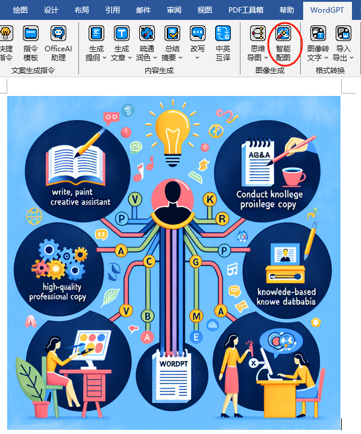

### **3.12自动排版**

(1)样式设置：样式设置：内置【自定义】、【论文】、【公文】三种排版样式，可点击【样式设置】按钮进行自定义设置。

(2)自动排版：设置好排版样式后，点击【自动排版】按钮可以将文章按照选定的样式自动设置格式。

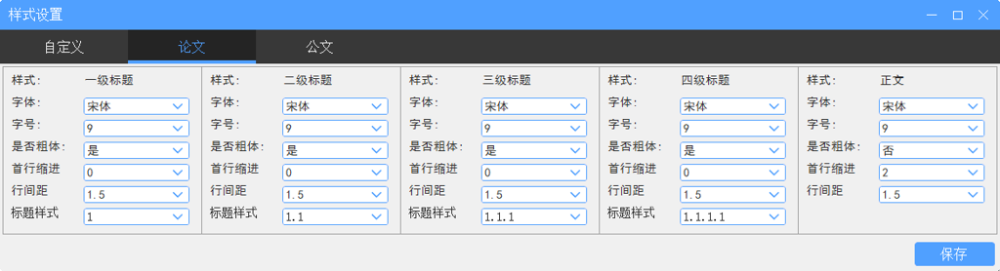

详细操作步骤可参考以下视频：[https://www.bilibili.com/video/BV1Vm42157Qj/](https://www.bilibili.com/video/BV1Vm42157Qj/ "https://www.bilibili.com/video/BV1Vm42157Qj/")

### **3.13 图片转文字**

运行功能可以将图片中的文字识别进当前文档，提供以下两种方式

(1)截屏识别：截取屏幕选中需要识别的区域进行识别

(2)选择图片识别：选择jpg、png等格式文件对图片文件进行识别

### **3.14PDF工具**

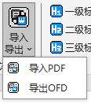

(1)导入PDF文件，运行功能选择需要导入转换的的Pdf文档，即可带格式将Pdf文件转换成Word文件。

(2)导出ODF文件，运行功能可将当前文档导出成ODF格式文件

### **3.15**生成PPT

点击【生成PPT按钮】将Word文档摘要填入【主题】框中，点击【生成提纲】按钮即可快速生成PPT提纲，并支持微调后自动生成带排版内容的PPT演讲稿。

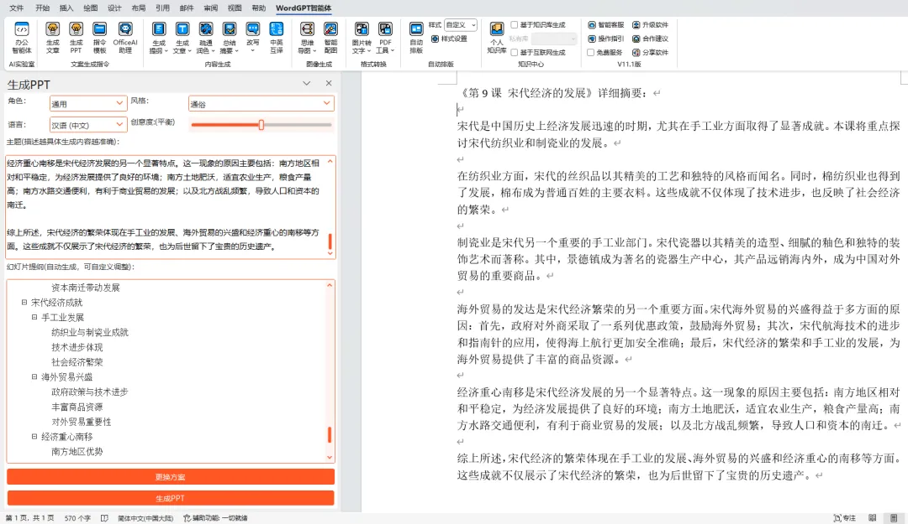

操作视频步骤可参考以下视频：[https://www.bilibili.com/video/BV1mH4y1F7K9/](https://www.bilibili.com/video/BV1mH4y1F7K9/ "https://www.bilibili.com/video/BV1mH4y1F7K9/")

## **4软件卸载**

在Windows控制面板->添加删除程序界面中找到OfficeAI.Chat办公智能体套包项，鼠标右键选择【卸载】

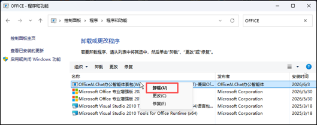

# **5 联系我们**

可通过扫码添加微信联系我们：WordGPT_KF

