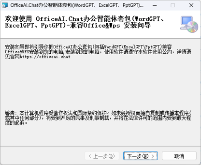
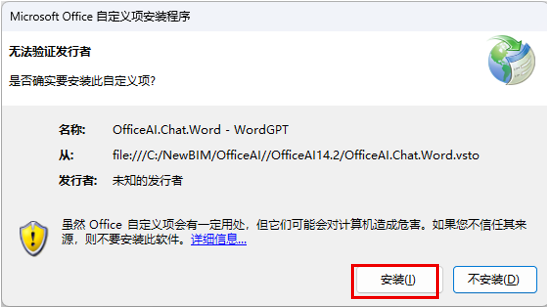
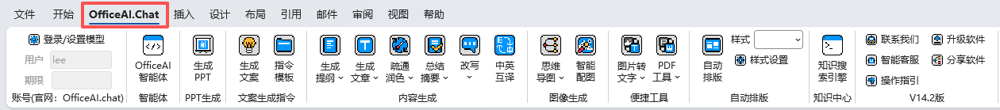

# OfficeAI.Chat

### 原 WordGPT — 一站式 AI 智能内容创作与文稿处理插件

[下载软件](#-软件下载) · [功能介绍](#-功能说明) · [安装教程](#-软件安装) · [联系我们](#-联系我们)

---

## 软件简介

OfficeAI.Chat（原 WordGPT）是一款深度适配办公全场景的 AI 智能插件，覆盖内容创作、文稿处理、智能排版、多语种翻译等核心办公需求，大幅提升文档工作效率。

| 核心能力                   | 说明                                                                                                                                                 |
| :------------------------- | :--------------------------------------------------------------------------------------------------------------------------------------------------- |
| **多元内容智能生成** | 接入私有知识库或联网检索，一键产出论文、简历、博文、新闻稿、产品文案、商务邮件、影视剧本、工作总结等各类文稿；同步生成思维导图、配图、数据图表及 PPT |
| **全维度文本精加工** | 全文校对、语句润色、内容提炼、篇幅扩写与精简缩写，智能筛查语病与逻辑漏洞，输出优化改写版本                                                           |
| **多语种即时翻译**   | 覆盖全球多语种互译，满足外文写作、文档翻译、跨境办公等需求                                                                                           |
| **智能排版自动化**   | 一键自动规整全文版式、统一格式样式，省去手动排版耗时                                                                                                 |

> **适配环境：** Windows 系统（推荐 Win10+） · Office 2012+ · WPS 最新版

---

## 软件安装

### 软件下载

| 下载渠道 | 链接                                                                |
| :------- | :------------------------------------------------------------------ |
| 123 云盘 | [下载地址 1](https://www.123pan.com/s/Czz1Td-glxxA.html)               |
| 百度网盘 | [下载地址 2](https://pan.baidu.com/s/1iNtgi479sWEk0ZmUoibqTQ?pwd=NewB) |

> [!IMPORTANT]
> 安装前请关闭 Office、WPS 等相关软件；部分无管理员权限的电脑建议先关闭杀毒软件，安装完成后再开启。

### 安装步骤

**第一步：安装插件**

双击或以管理员身份运行 `setup.exe`，按向导依次点击【下一步】完成安装。

**第二步：确认安装**

进入 Office（Word / Excel / PowerPoint）后点击确认安装。

### 软件升级

点击【升级软件】按钮即可自动检查并更新到最新版本。如有新版本，等待下载完成后按向导步骤执行更新安装，完成后重新打开 Word 或 WPS 即可。

|              升级菜单              |              升级界面              |
| :--------------------------------: | :--------------------------------: |
|  |  |

### 登录与模型配置

#### 方式一：用户登录（目前免费）

- 勾选「登录 - 使用软件默认模型」，输入用户名和密码点击【确定】
- 新用户点击【免费注册】注册账号后登录
- 忘记密码可通过手机号重置

#### 方式二：自定义模型 API（永久免费）

勾选「免登录 - 使用自定义模型」，按以下步骤配置：

| 配置项            | 说明                                                                                        |
| :---------------- | :------------------------------------------------------------------------------------------ |
| **模型 ID** | 推荐：深度求索 DeepSeek-V4-Flash、智谱 GLM5.1、阿里 Qwen3.7-Max、OpenAI GPT-5.5（境外用户） |
| **API Key** | 进入大模型管理后台复制 API Key 并粘贴                                                       |
| **API Url** | 进入大模型管理后台复制 API Url 并粘贴（注意末尾需带 `/v1` 版本号）                        |

> [!TIP]
> 软件已预置 DeepSeek、智谱、阿里百炼等主流平台的标准地址，选择后自动填入。内网可通过 Ollama 完全离线使用，地址格式：`http://[服务器IP]:11434/v1`

---

## 功能说明

### 功能菜单

### OfficeAI 智能体

OfficeAI 智能体是具备自主任务拆解与执行能力的办公智能助手。仅需下达自然语言目标，智能体自动规划流程、落地执行，代替枯燥繁琐的手工操作。

#### 文档编辑与处理

| 功能       | 说明                                   |
| :--------- | :------------------------------------- |
| 润色改写   | 优化文字表达，让语句更流畅、专业、地道 |
| 扩写丰富   | 在原文基础上扩展内容，增加细节描述     |
| 总结摘要   | 提炼长文本核心观点，快速获取关键信息   |
| 翻译       | 多语种互译，自动识别源语言             |
| 查找替换   | 批量替换文档中的指定文字               |
| 标点转换   | 中文/英文标点符号批量互转              |
| 清除空字符 | 删除文档中的多余空格和空白字符         |

#### 排版与美化

| 功能         | 说明                                     |
| :----------- | :--------------------------------------- |
| 一键排版     | 按公文、论文或自定义样式自动排版         |
| 设置文字格式 | 修改字体、字号、颜色、加粗、斜体、对齐等 |
| 批量调整图片 | 统一设置文档中所有图片的尺寸             |
| 背景颜色     | 设置文档页面背景色                       |
| 删除页眉横线 | 一键去除页眉底的边框线                   |
| 语法检查     | 开启/关闭拼写和语法检查                  |

#### 智能生成

| 功能         | 说明                               |
| :----------- | :--------------------------------- |
| 思维导图     | 根据主题生成脑图，梳理知识框架     |
| 知识图谱     | 展示概念之间的关系图谱             |
| 数据分析图表 | 对数据进行分析并生成可视化图表     |
| AI 绘图      | 根据文字描述生成图片               |
| 地图标记     | 标注地址位置，可视化展示           |
| 创建表格     | 生成对比表、数据统计表等结构化表格 |

> [!TIP]
> 可以这样跟智能体交流：
>
> - 「帮我把这篇文章按公文格式一键排版」
> - 「把选中的段落润色改写，让语句更专业」
> - 「总结这篇文章的核心观点，生成摘要」
> - 「根据这个主题生成一张思维导图」
> - 「把全文的英文标点转换成中文标点」
> - 「帮我生成一张关于人工智能的配图」

---

### 生成提纲

选中关键词或关键短语，点击【生成提纲】，可根据需求选择精确、平衡、创新方案。

### 生成文章

选中提纲或短语，点击【生成文章】，同样支持精确、平衡、创新三种方案。

### 疏通润色

选择需要润色的段落，点击【疏通润色】，优化结果以批注形式呈现，方便与原文对比。满意后可直接复制替换回文档。

### 总结摘要

对选中段落点击【总结摘要】，结果以批注形式呈现，方便与原文对比。

### 改写（扩写 / 缩写）

- **扩写**：选中短语点击【扩写】，可在原文基础上丰富内容，重复执行可持续扩写
- **缩写**：选中段落点击【缩写】，在不改变原意的情况下精简文字

### 中英互译

选中文本即可进行中英文互译，自动识别源语言。

### 快捷指令

点击【快捷指令】进入提示语配置界面，可灵活设置角色、风格、类型、语言及生成要求，定义完成后点击生成。

> [!NOTE]
> 角色、风格、类型、语言等选项如下拉列表中没有所需项，可直接手动输入（如「西班牙语」「数据报表」等）。生成篇幅分短、中、长三档，实际输出以大模型生成为准。

### 指令模板

内置大量提示语模板，选择后可修改 `【】` 标签内的文本参数，直接调用生成。

### 思维导图

> [!WARNING]
> 仅支持 Word，WPS 暂不支持

- **总结型**：选中文章段落 → 点击【思维导图】→【平衡方案】，自动生成段落结构图
- **预测型**：选中关键词 → 点击【思维导图】→【创新方案】，自动生成头脑风暴思维导图

### 智能配图

选中关键字或短语，点击【智能配图】，自动生成文章配图。

### 自动排版

内置「自定义」「论文」「公文」三种排版样式，支持自定义设置。设置好样式后点击【自动排版】即可自动格式化全文。

|              排版入口              |                排版设置                |
| :---------------------------------: | :-------------------------------------: |
|  |  |

操作视频：[Bilibili 教程](https://www.bilibili.com/video/BV1Vm42157Qj/)

### 图片转文字

支持两种识别方式：

- **截屏识别**：截取屏幕指定区域进行 OCR 识别
- **选择图片识别**：选择 JPG、PNG 等格式文件进行识别

### PDF 工具

- **导入 PDF**：选择 PDF 文件，带格式转换为 Word 文档
- **导出 PDF**：将当前文档导出为 PDF 格式文件

### 生成 PPT

点击【生成 PPT】，将文档摘要填入主题框，点击【生成提纲】快速生成 PPT 提纲，支持微调后自动生成带排版内容的 PPT 演讲稿。

操作视频：[Bilibili 教程](https://www.bilibili.com/video/BV1mH4y1F7K9/)

---

## 软件卸载

在 Windows 控制面板 → 程序和功能 中找到「OfficeAI.Chat 办公智能体套包」，右键选择【卸载】即可。

---

## 联系我们

扫码添加微信联系我们：**WordGPT_KF**

---

*如果这个项目对你有帮助，请给我们一个 Star 支持！*

